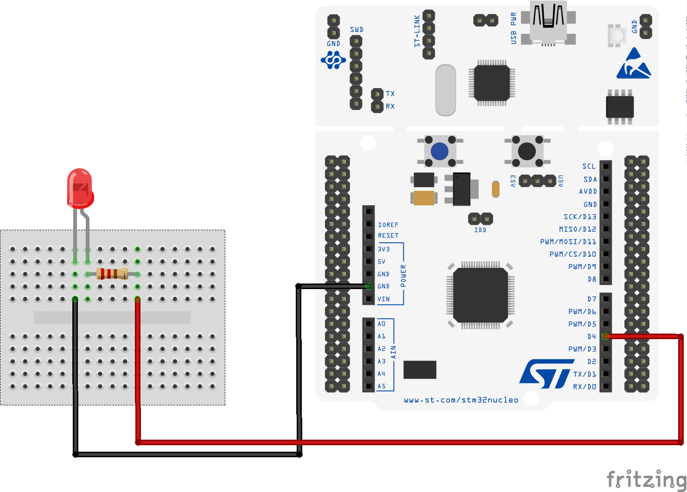

# How to use an External LED with RIOT

Make an simple external LED circuit with an [STM32 Nucleo-64 F401RE development board](https://www.st.com/en/evaluation-tools/nucleo-f401re.html) and the [RIOT operating system](https://github.com/RIOT-OS/RIOT).

Introductory material on how to setup a new RIOT application is provided in the [blog entry in hackster.io](https://www.hackster.io/ichatz/using-a-digital-temperature-sensor-with-riot-os-a4c213).

## For this application we will use
- STM32 Nucleo-64 F401RE
- LED
- Resistor 220 ohm
- 2 male to male jumper wires

## STM32 Nucleo-64 F401RE development board

The [STM32 Nucleo-64 F401RE](https://www.st.com/en/evaluation-tools/nucleo-f401re.html) is a low-cost development board that utilizes a 32-bit ARM Cortex-M4 processor to power various combinations of performance and power consumption. The CPU frequency can go as high as 84 MHz while the power consumption can go as low as 2.4uA at standby without RTC. The STM32 Nucleo board supports the ARDUINO® Uno V3 connectivity headers and the ST morpho headers allowing the easy expansion of the functionality with a wide choice of specialized shields.

## The RIOT operating system

The [RIOT](https://github.com/RIOT-OS/RIOT) is an open-source microkernel-based operating system designed for very low memory and energy footprint suitable for embedded devices that depend on real-time capabilities. RIOT provides out-of-the-box support for a very wide low-power wireless and communication stacks, making it an ideal choice to build Internet of Things (IoT) platforms.

## Hardware setup of a simple LED circuit with the STM32 Nucleo-64 F401RE board

The simplest circuit to power an LED is to connect it to a voltage source with a resistor in series, also known as the _ballast_ resistor. The _ballast_ resistor is crucial to make sure that the current passing through the LED will not burn it. In this example we will use a 220 ohm _ballast_ resistor. A detailed explanation on how to calculate the necessary resistance [can be found in the blog entry at EE Power](The resistance of the ballast resistor is easy to calculate with).

Notice that the LED has two pins: one of the pins is longer. The longer pin is the positive end of the led and is called the _anode_. The other pin is called the _cathode_.

Connect one side of the _ballast_ resistor with the _anode_ pin of the LED, and the other side of the _ballast_ resistor with the **GND pin** of the STM32 Nucleo board.

Connect the _cathode_ pin of the LED with the **D4 pin** of the STM32 Nucleo board.



## Controlling the GPIO in the RIOT operating system

[RIOT](https://github.com/RIOT-OS/RIOT) provides a low-level GPIO (General-purpose input/output) peripheral driver to allow platform independent basic access to an MCU's input/output pins. We need to specify in the [Makefile](Makefile) that we wish to use the GPIO peripheral of the board.

```
USEMODULE += periph_gpio
```

In this example application we wish to make the LED blink periodically. For this reason we will use the _xtimer_ module that provides a high-level API to multiplex the available timers. We add the following line in the [Makefile](Makefile):

```
USEMODULE += xtimer
```

In the [main.c](main.c) we also need to include the following header files:

```
#include "periph/gpio.h"
#include "xtimer.h"
```

The GPIO interface is intentionally designed to be as simple as possible, to allow for easy implementation and maximum portability. All modern micro controllers organize their GPIOs in some form of ports, often named 'PA', 'PB', 'PC'..., or 'P0', 'P1', 'P2'..., or similar. Each of these ports is then assigned a number of pins, often 8, 16, or 32. To access a pin, the _GPIO_PIN(port, pin) macro_ should be used.

For the case of the STM32 Nucleo board used here, the mapping of the ARDUINO® Uno V3 connectivity headers with the MCU's internal pins can be found in the [user manual UM1724 of the STM32 Nucleo F401RE board](https://www.st.com/resource/en/user_manual/dm00105823-stm32-nucleo64-boards-mb1136-stmicroelectronics.pdf).

The figure below indicates that the **D4 pin** is connected to the **PB** port of the MCU at pin number **5**.


The GPIO interface provides capabilities to initialize a pin as output-, input- and interrupt pin. Within the [main.c](main.c) file we need to use the _gpio_init_ method to signal that **pin PB5** should be initialized for output (**GPIO_OUT**) as follows:


```
gpio_t pin_out = GPIO_PIN(PORT_B, 5);
if (gpio_init(pin_out, GPIO_OUT)) {
    printf("Error to initialize GPIO_PIN(%d %d)\n", PORT_B, 5);
    return -1;
}
```

Now we can make the LED blink periodically as follows:

```
while(1)
{
  printf("Set pin to HIGH\n");
  gpio_set(pin_out);

  xtimer_sleep(2);

  printf("Set pin to LOW\n");
  gpio_clear(pin_out);

  xtimer_sleep(2);
}
```


## Running the code

To build and use the applications you need to make sure that you have a local copy of the RIOT main code. For detailed instructions on how to clone and build the RIOT OS follow [the instructions in the RIOT repository](https://github.com/RIOT-OS/RIOT/blob/master/README.md#getting-started) and the READMEs within the respective application directory.

From the command line you can compile the code, upload it to the MCU and then open the serial port to monitor the debug output as follows:

```
make BOARD=nucleo-f401re flash term
```

At this point, given that RIOT along with the STM32 tool-chain are properly installed in your system, you should start getting debug messages like the following:

```
main(): This is RIOT! (Version: 2021.04-devel-200-g67e5a)
RIOT led_ext application
Control an external LED using RIOT GPIO module.
Set pin to HIGH
Set pin to LOW
```
