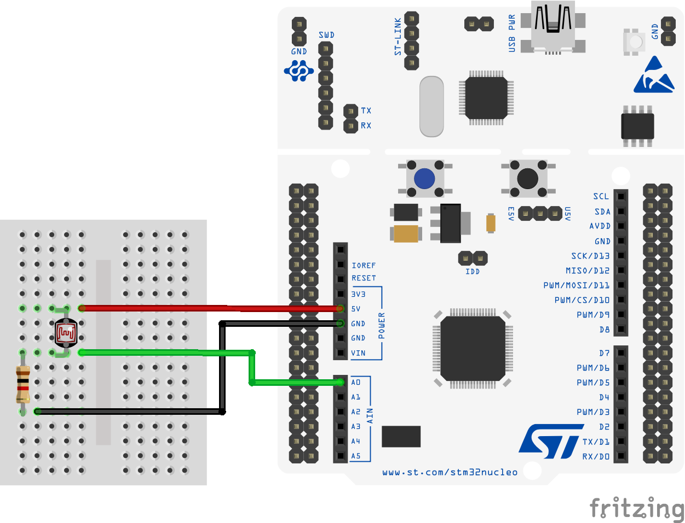

# How to use a Photocell with RIOT

Measure the intensity of ambient light with an [STM32 Nucleo-64 F401RE development board](https://www.st.com/en/evaluation-tools/nucleo-f401re.html) and the [RIOT operating system](https://github.com/RIOT-OS/RIOT).

## For this application we will use
- STM32 Nucleo-64 F401RE
- Breadboard
- 1KOhm resistor
- Photocell (or Photoresistor, or Light-Dependent-Resistor LDR)
- 3 Male to male jumper wires

## STM32 Nucleo-64 F401RE development board

The [STM32 Nucleo-64 F401RE](https://www.st.com/en/evaluation-tools/nucleo-f401re.html) is a low-cost development board that utilizes a 32-bit ARM Cortex-M4 processor to power various combinations of performance and power consumption. The CPU frequency can go as high as 84 MHz while the power consumption can go as low as 2.4uA at standby without RTC. The STM32 Nucleo board supports the ARDUINO® Uno V3 connectivity headers and the ST morpho headers allowing the easy expansion of the functionality with a wide choice of specialized shields.

## Hardware setup of the Photocell with the STM32 Nucleo-64 F401RE board

The photocell is a light-controlled variable resistor. When the photocell is struck
by light it drastically decreases its resistance until it reaches 500Ohm. In the absence of ambient light, the resistance of the photocell will become so high as 50KOhm which practically is non-conductive.

In order to monitor the varying resistance of the photocell we will use the STM32 Nucleo board's analog input. The simplest way to do this is to combine the photocell with a fixed 1KOhm resistor to create a potentiometer-like behavior. When the light is very bright, then the resistance of the photocell is very low compared with the fixed value resistor, and so it is as if the potentiometer was turned to maximum. When the photocell is in dull light, the resistance becomes greater than the fixed 1KOhm resistor and it is as if the potentiometer was being turned towards GND.

Position the photocell and the 1KOhm resistor in series using three vertical columns of the breadboard. Use a jumper wire to connect the top connector of the photocell with the **5V pin** of the STM32 Nucleo board. Connect the bottom connector of the photocell - the one that is connected with the 1KOhm resistor - with the **A0 pin** of the STM32 Nucleo board. Finally connect the bottom connector of the 1KOhm resistor with the **GND pin** of the STM32 Nucleo board.

The wiring of the components is shown in the figure below.



## Setting up the ADC in the RIOT operating system

[RIOT](https://github.com/RIOT-OS/RIOT) provides a very simple ADC interface to allow platform independent access to an MCU's ADC unit. We need to specify in the [Makefile](Makefile) that we wish to use the ADC peripheral of the board.

```
FEATURES_REQUIRED += periph_adc
```

In the [main.c](main.c) we also need to include the following header files:

```
#include "periph/adc.h"
#include "periph/gpio.h"
```

The ADC driver interface is built around the concept of ADC lines. An ADC line in this context is a tuple consisting out of a hardware ADC device (an ADC functional unit on the MCU) and an ADC channel connected to pin.

For the STM32 Nucleo F401RE board the **A0 pin** is mapped into the 0 line. Moreover, the ADC resolution is 12Bit.

Therefore in the [main.c](main.c) we define two constants for the ADC line and the resolution that we will use to sample:

```
#define ADC_IN_USE  ADC_LINE(0)
#define ADC_RES     ADC_RES_12BIT
```

The ADC is initialized using the _adc_init()_ function as follows:

```
/* initialize the ADC line */
if (adc_init(ADC_IN_USE) < 0) {
    printf("Initialization of ADC_LINE(%u) failed\n", ADC_IN_USE);
    return 1;

} else {
    printf("Successfully initialized ADC_LINE(%u)\n", ADC_IN_USE);
}
```

## Sampling the ADC

The ADC is sampled using the _adc_sample()_ function as follows:

```
int sample = 0;

sample = adc_sample(ADC_IN_USE, RES);
```

The sample value ranges from 0 ... 4095. We can convert the analog value into lux by using then [Analog data conversion utilities](http://api.riot-os.org/group__sys__analog__util.html) provided by RIOT. To do so, we need to specify in the [Makefile](Makefile) that we wish to use the _analog_util_ module as follows:

```
USEMODULE += analog_util
```

Moreover, within the [main.c](main.c) file we need to include the _analog_util.h_ header as follows:

```
#include "analog_util.h"
```

Now we can map the channel resolution to the lux range 10..100. This is done using the utility function _adc_util_map()_ as follows:

```
int lux = 0;

lux = adc_util_map(sample, ADC_RES, 10, 100);
```

## Periodic sampling of the analog sensor

In a normal computing environment, executing a piece of code periodically can be implemented in many different ways. However for IoT devices, we need to make sure that time-based functions are implemented in an energy efficient way, always making sure that threads are not keeping the CPU busy or block it from entering a low power consumption state. It is therefore recommended to avoid using POSIX functions, and use the native RIOT functions.

RIOT provides a high-level API to multiplex the available timers. In order to use this API we need to specify in the [Makefile](Makefile) that we wish to use the _xtimer_ module as follows:

```
USEMODULE += xtimer
```

Moreover, within the [main.c](main.c) file we need to include the _xtimer.h_ header as follows:

```
#include "xtimer.h"
```

We would like to sample the photocell every 100ms. For this reason we declare a constant _DELAY_ as follows:

```
#define DELAY  (100LU * US_PER_MS) /* 100 ms */
```

We can access the current system time as 32bit time stamp value as follows:

```
xtimer_ticks32_t last = xtimer_now();
```

The _xtimer_periodic_wakeup()_ function can be used to suspend the calling thread until the absolute time (last_wakeup + period).

```
xtimer_periodic_wakeup(&last, DELAY);
```


## Running the code

To build and use the applications you need to make sure that you have a local copy of the RIOT main code. For detailed instructions on how to clone and build the RIOT OS follow [the instructions in the RIOT repository](https://github.com/RIOT-OS/RIOT/blob/master/README.md#getting-started) and the READMEs within the respective application directory.

From the command line you can compile the code, upload it to the MCU and then open the serial port to monitor the debug output as follows:

```
make BOARD=nucleo-f401re flash term
```

At this point, given that RIOT along with the STM32 tool-chain are properly installed in your system, you should start getting debug messages like the following:

```
RIOT Photocell application
Measure the intensity of ambient light using a photocell
connected to the Analog input of the STM32 Nucleo-64 board.
The sensor is sampled through the ADC lines once every 100ms
with a 12-bit resolution and print the sampled results to STDIO
Successfully initialized ADC_LINE(0)
ADC_LINE(0): raw value: 3048, lux: 76
ADC_LINE(0): raw value: 3051, lux: 77
```

## Technical details on using timer in the RIOT operating system

When we wish to suspend the execution of a thread based on the _xtimer_ module using the _xtimer_tsleep()_ function, the following actions will take place:
1. A new _MUTEX_ is created,
1. An alarm is configured to fire after the desired period of time to _UNLOCK_ the _MUTEX_,
1. _LOCK_ the _MUTEX_,
1. Remove the active thread from the thread queue,
1. Block it by setting the thread's status to _STATUS_MUTEX_BLOCKED_,
1. When the hardware interrupt is raised, the call back function of the alarm will be invoked,
1. The call back function will _UNLOCK_ the _MUTEX_ and set the user's thread's status to _STATUS_PENDING_.

The code for the above logic can be found in the [xtimer implementation](https://github.com/RIOT-OS/RIOT/blob/master/sys/xtimer/xtimer.c):

```
xtimer_t timer;
mutex_t mutex = MUTEX_INIT;

timer.callback = _callback_unlock_mutex;
timer.arg = (void*) &mutex;

mutex_lock(&mutex);
_xtimer_set64(&timer, offset, long_offset);
mutex_lock(&mutex);
```

The _xtimer_set64()_ will insert the timer into a singly linked list, thus incurring an O(n) complexity with (n) being the number of active timers. The same complexity is required for the removal of the timer when the alarm fires.

Notice that if the _xtimer_tsleep()_ function is used for very short periods, e.g., less than _XTIMER_BACKOFF_ - which is typically set to 50us, then the above mechanism will not be used. Instead the thread will be **blocked** using the _xtimer_spin()_ function as follows:

```
uint32_t start = _xtimer_lltimer_now();
while ((_xtimer_lltimer_now() - start) < offset);
```

If we wish to use long periods of time in microseconds, 32bit can hold 71 minutes. When using milliseconds, 32bit can hold 49days. On the other hand a 64bit unsigned value can hold >584years in nanoseconds, thus clearly simplifying our code.


## Technical details on the configuration of an MCU in the RIOT operating system

RIOT supports a very broad range of low-power IoT devices and microcontroller architectures (32-bit, 16-bit, 8-bit). The ADC interface is intentionally designed as simple as possible, to allow for very easy implementation and maximal portability.

The ADC is configured using the _adc_conf_t_ structure. Since each different MCU may support different ADC capabilities, for the family of STM32 boards the definition can be found in the file [periph_cpu.h](https://github.com/RIOT-OS/RIOT/blob/master/cpu/stm32/include/periph_cpu.h).

Given the above structure, the capabilities and configuration of each [platform supported by RIOT](https://github.com/RIOT-OS/RIOT/wiki/RIOT-Platforms) is located within the [boards folder of the RIOT source tree](https://github.com/RIOT-OS/RIOT/blob/master/boards/).

For the STM32 Nucleo F401RE board in particular, the mapping of the internal pins of the MCU with the ADC lines of the RIOT operating system are defined within the _boards/nucleo-f401re folder_ under the [periph_conf.h](https://github.com/RIOT-OS/RIOT/blob/master/boards/nucleo-f401re/include/periph_conf.h) file.

```
static const adc_conf_t adc_config[] = {
    {GPIO_PIN(PORT_A, 0), 0, 0},
    {GPIO_PIN(PORT_A, 1), 0, 1},
    {GPIO_PIN(PORT_A, 4), 0, 4},
    {GPIO_PIN(PORT_B, 0), 0, 8},
    {GPIO_PIN(PORT_C, 1), 0, 11},
    {GPIO_PIN(PORT_C, 0), 0, 10},
};

#define ADC_NUMOF           ARRAY_SIZE(adc_config)
```

The above configuration defines only the ADC channels available through the ARDUINO® Uno V3 connectivity header CN8, pins A0..A5.

The mapping of the ARDUINO® Uno V3 connectivity headers with the MCU's internal pins as well as the resolution of the ADC can be found in the [user manual of the STM32 Nucleo F401RE board](https://www.st.com/resource/en/user_manual/dm00105823-stm32-nucleo64-boards-mb1136-stmicroelectronics.pdf). In particular [Figure 18, page 32](https://github.com/RIOT-OS/RIOT/blob/master/boards/nucleo-f401re/include/periph_conf.h) identifies that pin A0 is connected to the MCU's GPIO pin PA0.

Looking into the [specifications of the STM32F401RE MCU](https://www.st.com/resource/en/datasheet/stm32f401re.pdf) that is used by the Nucleo-64 F401RE development board we identify that the PA0 port of the MCU is using channel 1.
