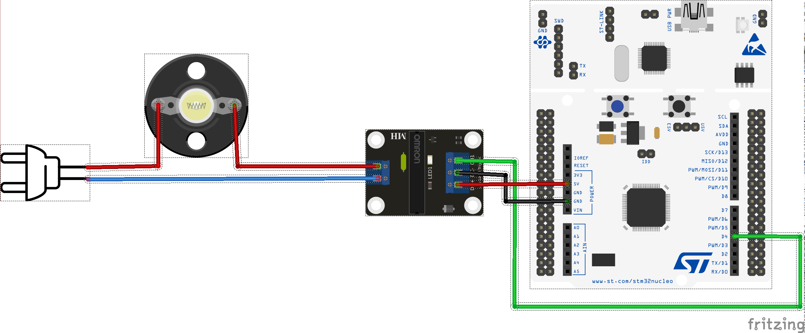
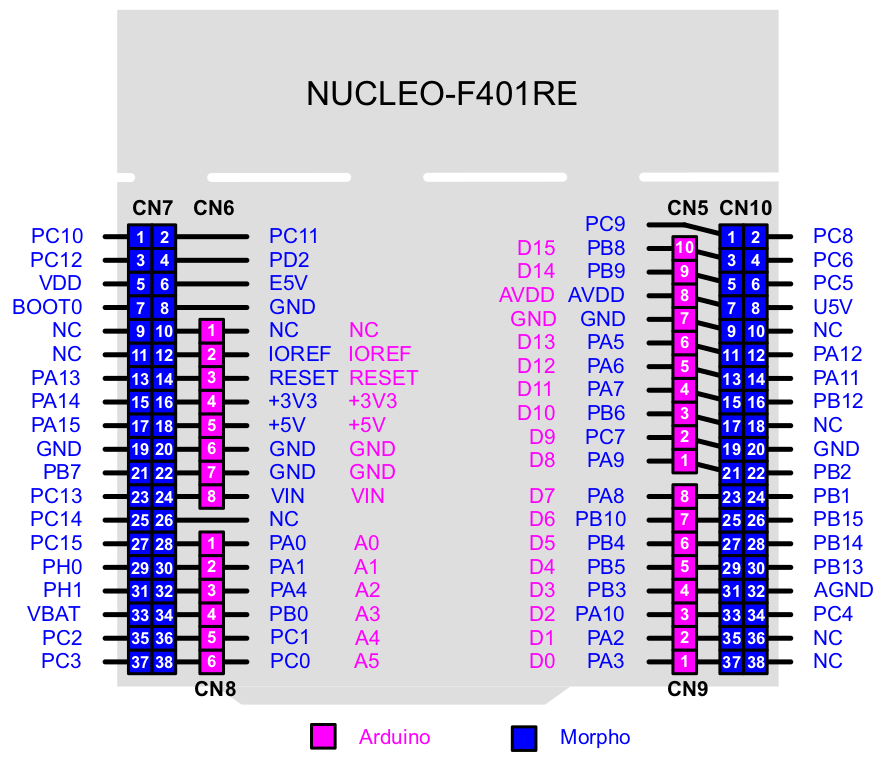

# How to drive an SSD Relay Module with RIOT

Drive an SSD Relay Module to control a 220V AC device with an [STM32 Nucleo-64 F401RE development board](https://www.st.com/en/evaluation-tools/nucleo-f401re.html) and the [RIOT operating system](https://github.com/RIOT-OS/RIOT).

**WARNING -- In this example we will work with HIGH VOLTAGES that can cause SERIOUS INJURY, DEATH, AND/OR SET YOUR HOUSE ON FIRE!!. MAKE SURE YOU ALWAYS PROCEED WITH CAUTION, AND ALWAYS MAKE SURE CIRCUITS ARE UN-PLUGGED BEFORE WORKING ON THEM**

Controlling a low-power external device, like a LED, can be achieved using the MCU's GPIO (General Purpose Input/Output) pins, like in [the example with the blinking LED](../ledext). Large power devices that require 110-240V cannot be controlled in this way. What is needed is an external circuit based on a relay switch that allows to controls the high voltage using the low voltage of the MCU. The external circuit also helps isolate the high voltage components from the low voltage ones.

Introductory material on how to setup a new RIOT application is provided in the [blog entry in hackster.io](https://www.hackster.io/ichatz/control-external-led-using-riot-os-b626da).

## For this application we will use
- STM32 Nucleo-64 F401RE
- SSD Relay Module
- 3 male to male jumper wires
- 12-gauge wire
- Lightbulb socket

## STM32 Nucleo-64 F401RE development board

The [STM32 Nucleo-64 F401RE](https://www.st.com/en/evaluation-tools/nucleo-f401re.html) is a low-cost development board that utilizes a 32-bit ARM Cortex-M4 processor to power various combinations of performance and power consumption. The CPU frequency can go as high as 84 MHz while the power consumption can go as low as 2.4uA at standby without RTC. The STM32 Nucleo board supports the ARDUINO® Uno V3 connectivity headers and the ST morpho headers allowing the easy expansion of the functionality with a wide choice of specialized shields.

## The RIOT operating system

The [RIOT](https://github.com/RIOT-OS/RIOT) is an open-source microkernel-based operating system designed for very low memory and energy footprint suitable for embedded devices that depend on real-time capabilities. RIOT provides out-of-the-box support for a very wide low-power wireless and communication stacks, making it an ideal choice to build Internet of Things (IoT) platforms.


## Hardware setup of SSD relay module with the STM32 Nucleo-64 F401RE board
In this circuit we use an SSD relay module to control a 220V lump. The benefit of using an SSD relay is that it contains no moving parts. Therefore, the mechanism does not wear-out with the continuous usage, theoretically supporting millions of activation/disactivation cycles. Additionally, the relay does not produce the characteristic noise of the moving parts used by electromagnetic relays.

Note that the SSD relay module used in this example drives AC devices. Connecting a DC component, for example a LED, will not work as it should.

The relay used here is the OMRON G3MB-202P that switches up to 2A loads. The **DC+ pin** of the relay module is connected to the **5V pin** of the STM32 Nucleo board. The **DC- pin** of the relay module is connected to the **GND pin** of the STM32 Nucleo board. The **CH1 pin** of the relay module is connected to the **D4 pin** of the STM32 Nucleo board.

The switching contacts of the relay marked with as **AC** are used to interrupt the electrical supply of the Lightbulb socket.



## Controlling the GPIO in the RIOT operating system

[RIOT](https://github.com/RIOT-OS/RIOT) provides a low-level GPIO (General-purpose input/output) peripheral driver to allow platform independent basic access to an MCU's input/output pins. We need to specify in the [Makefile](Makefile) that we wish to use the GPIO peripheral of the board.

```
USEMODULE += periph_gpio
```

In this example application we wish to switch on and off the Lightbulb periodically. For this reason we will use the _xtimer_ module that provides a high-level API to multiplex __the available timers. We add the following line in the [Makefile](Makefile):

```
USEMODULE += xtimer
```

In the [main.c](main.c) we also need to include the following header files:

```
#include "periph/gpio.h"
#include "xtimer.h"
```

The GPIO interface is intentionally designed to be as simple as possible, to allow for easy implementation and maximum portability. All modern micro controllers organize their GPIOs in some form of ports, often named 'PA', 'PB', 'PC'..., or 'P0', 'P1', 'P2'..., or similar. Each of these ports is then assigned a number of pins, often 8, 16, or 32. To access a pin, the _GPIO_PIN(port, pin) macro_ should be used.

For the case of the STM32 Nucleo board used here, the mapping of the ARDUINO® Uno V3 connectivity headers with the MCU's internal pins can be found in the [user manual UM1724 of the STM32 Nucleo F401RE board](https://www.st.com/resource/en/user_manual/dm00105823-stm32-nucleo64-boards-mb1136-stmicroelectronics.pdf).

The figure below indicates that the **D4 pin** is connected to the **PB** port of the MCU at pin number **5**.




The GPIO interface provides capabilities to initialize a pin as output-, input- and interrupt pin. Within the [main.c](main.c) file we need to use the _gpio_init_ method to signal that **pin PB5** should be initialized for output (**GPIO_OUT**) as follows:


```
gpio_t pin_out = GPIO_PIN(PORT_B, 5);
if (gpio_init(pin_out, GPIO_OUT)) {
    printf("Error to initialize GPIO_PIN(%d %d)\n", PORT_B, 5);
    return -1;
}
```

Now we can switch on and off the Lightbulb periodically as follows:

```
while(1)
{
  printf("Set pin to HIGH and signal SSD to switch on lightbulb\n");
  gpio_set(pin_out);

  xtimer_sleep(5);

  printf("Set pin to LOW and signal SSD to switch off lightbulb\n");
  gpio_clear(pin_out);

  xtimer_sleep(5);
}
```


## Running the code

To build and use the applications you need to make sure that you have a local copy of the RIOT main code. For detailed instructions on how to clone and build the RIOT OS follow [the instructions in the RIOT repository](https://github.com/RIOT-OS/RIOT/blob/master/README.md#getting-started) and the READMEs within the respective application directory.

From the command line you can compile the code, upload it to the MCU and then open the serial port to monitor the debug output as follows:

```
make BOARD=nucleo-f401re flash term
```

At this point, given that RIOT along with the STM32 tool-chain are properly installed in your system, you should start getting debug messages like the following:

```
main(): This is RIOT! (Version: 2021.04-devel-200-g67e5a)
RIOT relay_coap application
Control an external LED using RIOT GPIO module.
Set pin to HIGH and signal SSD to switch on lightbulb
Set pin to LOW and signal SSD to switch off lightbulb
```
