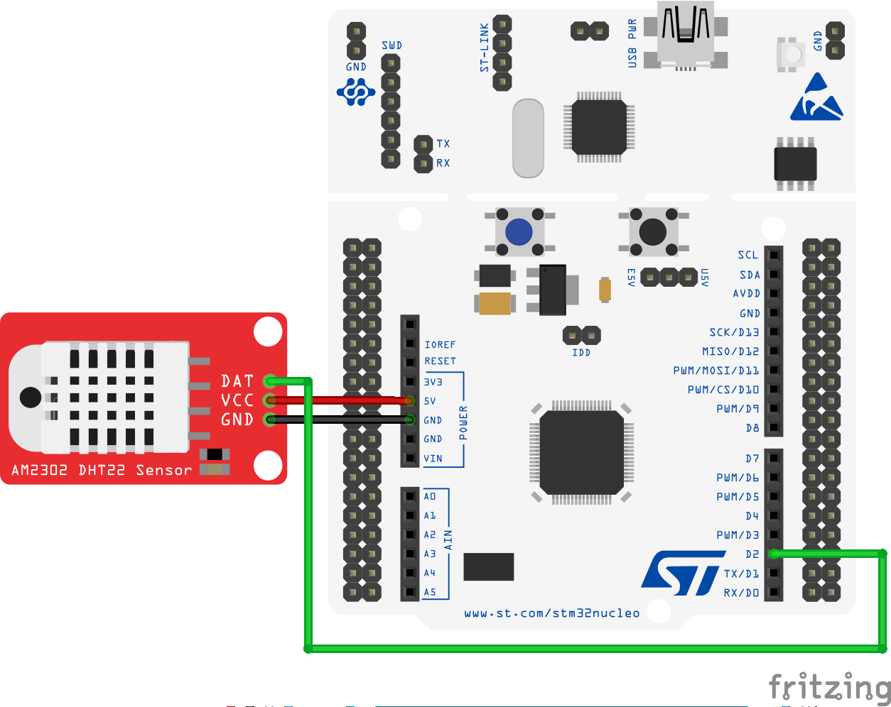
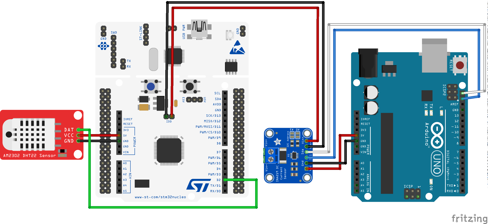
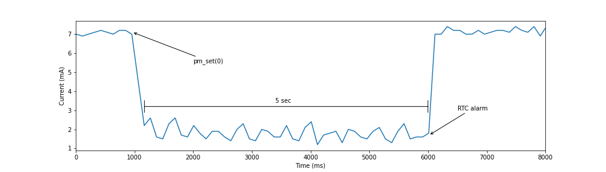

# How to use a Digital Sensor with RIOT

Measure the ambient temperature and humidity with an [STM32 Nucleo-64 F401RE development board](https://www.st.com/en/evaluation-tools/nucleo-f401re.html) and the [RIOT operating system](https://github.com/RIOT-OS/RIOT).

## For this application we will use
- STM32 Nucleo-64 F401RE
- DHT22 digital sensor
- 3 Female to male jumper wires

## STM32 Nucleo-64 F401RE development board

The [STM32 Nucleo-64 F401RE](https://www.st.com/en/evaluation-tools/nucleo-f401re.html) is a low-cost development board that utilizes a 32-bit ARM Cortex-M4 processor to power various combinations of performance and power consumption. The CPU frequency can go as high as 84 MHz while the power consumption can go as low as 2.4uA at standby without RTC. The STM32 Nucleo board supports the ARDUINO® Uno V3 connectivity headers and the ST morpho headers allowing the easy expansion of the functionality with a wide choice of specialized shields.

## The RIOT operating system

The [RIOT](https://github.com/RIOT-OS/RIOT) is an open-source microkernel-based operating system designed for very low memory and energy footprint suitable for embedded devices that depend on real-time capabilities. RIOT provides out-of-the-box support for a very wide low-power wireless and communication stacks, making it an ideal choice to build Internet of Things (IoT) platforms.

## Hardware setup of the Digital Sensor with the STM32 Nucleo-64 F401RE board

The DHT22 digital sensor is a very basic, slow, and low-cost sensor for measuring ambient temperature and humidity. It is made up from two parts: a _thermistor_ (or thermal resistor) that changes its resistance with temperature, and a _capacitive humidity sensor_ that measures the concentration of water vapor in the air. The DHT22 digital sensor includes the two sensors along with a very basic chip that takes care of converting the analog signals to digital so that it can be easily read by the MCU.

The DHT22 digital sensor has three pins:
- connect the GND pin with the **GND pin** of the STM32 Nucleo board,
- connect the VCC pin with the **5V pin** of the STM32 Nucleo board,
- connect the DAT pin with the **D2 pin** of the STM32 Nucleo board.

The wiring of the components is shown in the figure below.



## Setting up the DHT driver in the RIOT operating system

[RIOT](https://github.com/RIOT-OS/RIOT) provides a very simple device driver, named _dht_, to access the sensor values arriving from the DHT22 digital sensor. We need to specify in the [Makefile](Makefile) that we wish to use the _dht module_ (or driver).

```
USEMODULE += dht
```

The DHT digital sensor comes in two versions: the DHT11 and the DHT22. Both versions are supported by the _dht module_ of RIOT. For this reason, in the [main.c](main.c) we define a constant to fix the version we wish to use:

```
#define DHT_PARAM_TYPE  (DHT22)
```

In the [main.c](main.c) we also need to include the following header files:

```
#include "dht.h"
#include "dht_params.h"
```

The _dht module_ initialization function _dht_init()_ requires us to specify the pin where the **DAT pin** of the sensor is connected. In our case the **D2 pin** of the STM32 Nucleo F401RE board. We need to consult the [user manual UM1724 of the STM32 Nucleo F401RE board](https://www.st.com/resource/en/user_manual/dm00105823-stm32-nucleo64-boards-mb1136-stmicroelectronics.pdf) to identify that the **D2 pin** of the ARDUINO® Uno V3 connectivity headers corresponds to the MCU's **GPIO pin PA10**.

Therefore in the [main.c](main.c) we fix the port as follows:

```
dht_params_t my_params;
my_params.pin = GPIO_PIN(PORT_A, 10);
my_params.type = DHT_PARAM_TYPE;
my_params.in_mode = DHT_PARAM_PULL;
```

Now we can initialize the _dht module_ as follows:

```
dht_t dev;

if (dht_init(&dev, &my_params) == DHT_OK) {
    printf("DHT sensor connected\n");
}
else {
    printf("Failed to connect to DHT sensor\n");
    return 1;
}
```

## Sampling the DHT digital sensor

The DHT digital sensor can be sampled using the _dht_read()_ function as follows:

```
int16_t temp, hum;
if (dht_read(&dev, &temp, &hum) != DHT_OK) {
    printf("Error reading values\n");
}
```

The module encodes the sensor values using 16bit integers. Here we can use the _fmt module_ of RIOT to conveniently format the 16bit integers into formatted strings. To do so, we need to specify in the [Makefile](Makefile) that we wish to use the _fmt module_ as follows:

```
USEMODULE += fmt
```

Moreover, within the [main.c](main.c) file we need to include the _fmt.h_ header as follows:

```
#include "fmt.h"
```

Now we can use the _fmt module_ to extract the temperature value from the sensor reading:

```
char temp_s[10];    
size_t n = fmt_s16_dfp(temp_s, temp, -1);
temp_s[n] = '\0';
```

As well as the humidity value:

```
char hum_s[10];    
n = fmt_s16_dfp(hum_s, hum, -1);
hum_s[n] = '\0';
```

Finally we can print out a formatted string:

```
printf("DHT values - temp: %s°C - relative humidity: %s%%\n", temp_s, hum_s);
```

## Periodic sampling of the digital sensor using low power sleep

We now want to implement a periodic sampling of the digital sensor periodically. During the period between successive samplings, we wish to set the ARM Cortex M4 of the STM32 Nucleo F401RE in sleep mode to reduce the power consumption.

RIOT provides a hardware-independent high-level API to carry out power management. To use this API we need to specify in the [Makefile](Makefile) that we wish to use the _pm_ module as follows:

```
USEMODULE += pm
```

Moreover, within the [main.c](main.c) file we need to include the _pm.h_ header as follows:

```
#include "periph/pm.h"
```

In RIOT then low power sleep mode for the STM32F401RE MCU is labelled as **mode 0**. We use the _pm_set_ to specify that we wish to switch to **mode 0** as follows:

```
pm_set(0);
```

As soon as this command is executed, the MCU will enter a sleep mode where most clock signals are stopped and only a small part of the processor is running. The MCU can wake up from this state by an interrupt request, event input, debug request or reset.

In our application we wakeup the MCU from the sleep state by using the RTC clock. To do so we schedule an alarm for the RTC that will invoke an interrupt handler. Notice that the _xtimer_ module is not designed for being used in sleep modes.

RIOT provides a hardware-independent high-level API to interact with the RTC. To use this API we need to specify in the [Makefile](Makefile) that we wish to use the _rtc_ peripheral as follows:

```
FEATURES_OPTIONAL += periph_rtc
```

Moreover, within the [main.c](main.c) file we need to include the _pm.h_ header as follows:

```
#include "periph/rtc.h"
```

Now we are ready to define a generic interrupt handler that requires a single argument and uses _puts()_ to forward it to standard output:

```
static void callback_rtc(void *arg)
{
    puts(arg);
}
```

Finally, we will use the _rtc_get_time()_ function to retrieve the current time of the RTC and the _rtc_set_alarm()_ function to set the alarm based on the absolute time (current time + period). In this example the period is set to 5 seconds as follows:

```
struct tm time;
rtc_get_time(&time);
time.tm_sec += 5;
rtc_set_alarm(&time, callback_rtc, "Wakeup alarm");
```

## Running the code

To build and use the applications you need to make sure that you have a local copy of the RIOT main code. For detailed instructions on how to clone and build the RIOT OS follow [the instructions in the RIOT repository](https://github.com/RIOT-OS/RIOT/blob/master/README.md#getting-started) and the READMEs within the respective application directory.

From the command line you can compile the code, upload it to the MCU and then open the serial port to monitor the debug output as follows:

```
make BOARD=nucleo-f401re flash term
```

At this point, given that RIOT along with the STM32 tool-chain are properly installed in your system, you should start getting debug messages like the following:

```
main(): This is RIOT! (Version: 2021.04-devel-200-g67e5a)
RIOT temperature_humidity application
DHT temperature and humidity sensor test application
using RIOT DHT peripheral driver
DHT sensor type 1
DHT sensor connected
DHT values - temp: 22.3°C - relative humidity: 60.5%
Setting wakeup from mode 0 in 5 seconds.
main(): This is RIOT! (Version: 2021.04-devel-200-g67e5a)
RIOT temperature_humidity application
DHT temperature and humidity sensor test application
using RIOT DHT peripheral driver
DHT sensor type 1
DHT sensor connected
DHT values - temp: 22.2°C - relative humidity: 61.6%
Setting wakeup from mode 0 in 5 seconds.
```

In the above execution notice the debug output starting with _main():_ appearing twice. The first one appears when the STM32F401RE MCU is reset immediately after the firmware is flashed. The second one appears when the MCU wakes up as a result of the RTC alarm.

## Technical details on measuring the power consumption of the STM32F401RE MCU

Measuring current consumption with an STM32 Nucleo F401RE board is relatively simple. The development board provides a jumper labelled **IDD** that is used to measure the STM32F401RE MCU consumption using an ammeter.

The [user manual UM1724 of the STM32 Nucleo F401RE board](https://www.st.com/resource/en/user_manual/dm00105823-stm32-nucleo64-boards-mb1136-stmicroelectronics.pdf) states that when the jumper IDD is ON (default), the STM32 microcontroller is powered. When the jumper IDD OFF, an ammeter must be connected to measure the STM32 microcontroller
current. If there is no ammeter, the STM32 microcontroller is not powered.

Instead of using an ammeter, we will use the INA219 current sensor in combination with an ARDUINO® Uno board. The INA219 sensor communicates with the ARDUINO® Uno board via I2C. We connect the INA219 V+ and V- connectors to the IDD jumper of the STM32 board.

The wiring of the components across the two boards is shown in the figure below.



For this example we will program the ARDUINO® Uno board using the ARDUINO® IDE based on the [Adafruit INA219 library](https://learn.adafruit.com/adafruit-ina219-current-sensor-breakout/arduino-code):
1. Open up the Arduino library manager and search for the Adafruit INA219 library and install it.
1. Load the Example provided by Adafruit from by selecting _"File->Examples->Adafruit_INA219->getcurrent"_. The _"getcurrent"_ example code should open in a new IDE window.
1. Click on the upload button in the IDE.  When it is _"done uploading"_ open your Serial Monitor and set the speed to 115200 baud.

The output should appear similar to the sample below:

```
Bus Voltage:   3.04 V
Shunt Voltage: 0.72 mV
Load Voltage:  3.04 V
Current:       7.20 mA
Power:         22.00 mW

Bus Voltage:   3.10 V
Shunt Voltage: 0.12 mV
Load Voltage:  3.10 V
Current:       1.30 mA
Power:         4.00 mW
```

After modifying the example code and collecting a sufficient number of data, the following figure shows the outcome of the sleep mode:


