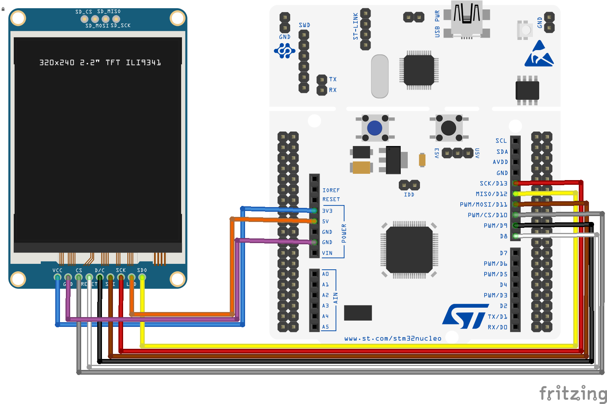

# How to use a TFT ILI9341 LCD with RIOT

Use a TFT ILI9341 LCD with an [STM32 Nucleo-64 F401RE development board](https://www.st.com/en/evaluation-tools/nucleo-f401re.html) and the [RIOT operating system](https://github.com/RIOT-OS/RIOT).

## For this application we will use
- STM32 Nucleo-64 F401RE
- 2.8" TFT ILI9341 LCD with 240RGBx320 resolution connected via SPI serial
- 9 Female to male jumper wires

## STM32 Nucleo-64 F401RE development board

The [STM32 Nucleo-64 F401RE](https://www.st.com/en/evaluation-tools/nucleo-f401re.html) is a low-cost development board that utilizes a 32-bit ARM Cortex-M4 processor to power various combinations of performance and power consumption. The CPU frequency can go as high as 84 MHz while the power consumption can go as low as 2.4uA at standby without RTC. The STM32 Nucleo board supports the ARDUINO® Uno V3 connectivity headers and the ST morpho headers allowing the easy expansion of the functionality with a wide choice of specialized shields.

## The RIOT operating system

The [RIOT](https://github.com/RIOT-OS/RIOT) is an open-source microkernel-based operating system designed for very low memory and energy footprint suitable for embedded devices that depend on real-time capabilities. RIOT provides out-of-the-box support for a very wide low-power wireless and communication stacks, making it an ideal choice to build Internet of Things (IoT) platforms.

## Hardware setup of the TFT ILI9341 LCD with the STM32 Nucleo-64 F401RE board

The ILI9341 is a 262144-color single-chip SOC driver for a TFT liquid crystal display with resolution of 240x320 dots (RGB), comprising a 720-channel source driver, a 320-channel gate driver, 172800 bytes GRAM for graphic display data of 240x320 dots (RGB), and power supply circuit.

ILI9341 can operate with 1.65V ~ 3.3V I/O interface voltage. ILI9341 supports parallel 8-/9-/16-/18-bit data bus MCU interface, 6-/16-/18-bit data bus RGB interface and 3-/4-line serial peripheral interface (SPI). In this example we will connect the TFT LCD via the SPI.

The TFT ILI9341 LCD has the following pins:
- connect the VCC with the **3V3 pin** of the STM32 Nucleo board,
- connect the GND pin with the **GND pin** of the STM32 Nucleo board,
- connect the CS pin with the **PWM/CS/D10 pin** of the STM32 Nucleo board.
- connect the RESET pin with the **D8 pin** of the STM32 Nucleo board.
- connect the DC pin with the **D9 pin** of the STM32 Nucleo board.
- connect the SDI (MOSI) pin with the **PWM/MOSI/D11 pin** of the STM32 Nucleo board.
- connect the SCK pin with the **SCK/D13 pin** of the STM32 Nucleo board.
- connect the LED pin with the **5V pin** of the STM32 Nucleo board.
- connect the SDO (MISO) pin with the **MISO/D12 pin** of the STM32 Nucleo board.

The wiring of the components is shown in the figure below.



For more information about the features of the ILI9341 controller  and how to integrate it in your project, you check the [ILI9341 specifications](https://cdn-shop.adafruit.com/datasheets/ILI9341.pdf).

## Setting up the TFT ILI9341 LCD in the RIOT operating system

RIOT provides a driver for the [ILI9341 display controller](https://api.riot-os.org/group__drivers__ili9341.html). The driver module allows to methods to initialize the TFT LCD display device, draw rectangles and write text characters.

In this example we will not use this driver. We will use the [ucglib](https://github.com/olikraus/ucglib), a graphic library for true color TFT and OLED graphics for embedded systems. displays for embedded devices. The _ucglib_ library supports the ST7735, ILI9341, PCF8833, SSD1351, LD50T6160, ILI9163 display controllers and offers a very rich set of graphic procedures and supports many fonts. The UCG library is developed for the Arduino IDE. Check out the [Reference Manual](https://github.com/olikraus/ucglib/wiki) for a detailed presentation.

The _ucglib_ library is available as a [RIOT package](http://doc.riot-os.org/group__pkg__ucglib.html), that is, an external library that is not included in the central repository. RIOT packages can be built out-of-source, that is, the source code of external packages is fetched in a global location, under the directory `$(RIOTBASE)/build/pkg/$(PKG_NAME)`.

To add the _ucglib_ package to the list of compiled modules you have to add it to the USEPKG macro in the [Makefile](Makefile) as follows:

```
USEPKG += ucglib
```

Since we are using the SPI to control the TFT LCD, we also need to specify in the [Makefile](Makefile) that we wish to use the _periph_spi_ and _periph_gpio_ modules.

```
FEATURES_REQUIRED += periph_gpio periph_spi
```

In the [main.c](main.c) we also need to include the following header files:

```
#include "periph/gpio.h"
#include "periph/spi.h"

#include "ucg.h"
#include "ucg_riotos.h"
```

The _ucglib_ initialization function _ucg_Init()_ requires us to specify the SPI device where the TFT is connected and specify the CS, CD (in the TFT noted as DC, see previous section) and RESET pins. In our case we use the first SPI device, and the **D10**, **D9** and **D8** pins of the STM32 Nucleo F401RE board. We need to consult the [user manual UM1724 of the STM32 Nucleo F401RE board](https://www.st.com/resource/en/user_manual/dm00105823-stm32-nucleo64-boards-mb1136-stmicroelectronics.pdf) to identify that
- the **D10 pin** of the ARDUINO® Uno V3 connectivity headers corresponds to the MCU's **GPIO pin PB6**
- the **D9 pin** of the ARDUINO® Uno V3 connectivity headers corresponds to the MCU's **GPIO pin PC7**
- the **D8 pin** of the ARDUINO® Uno V3 connectivity headers corresponds to the MCU's **GPIO pin PA9**

Therefore in the [main.c](main.c) we fix the port as follows:

```
static ucg_riotos_t user_data =
{
    .device_index = SPI_DEV(0),
    .pin_cs = GPIO_PIN(PORT_B, 6),
    .pin_cd = GPIO_PIN(PORT_C, 7),
    .pin_reset = GPIO_PIN(PORT_A, 9),
};
```

Now we can initialize the _ucglib_ as follows:

```
ucg_t ucg;

ucg_SetUserPtr(&ucg, &user_data);

ucg_Init(&ucg, ucg_dev_ili9341_18x240x320, ucg_ext_ili9341_18,
         ucg_com_hw_spi_riotos);
```

## Graphics drawing with the ILI9341 TFT

The _ucglib_ provides a number of functions to draw lines, rectangles, triangles, circles, and many other shapes on the TFT. The [reference manual](https://github.com/olikraus/ucglib/wiki/reference) provides multiple examples.

In this application we start by drawing the RIOT logo which is available as 96x48 pixels in RGB format (24 bits). Instead of providing the logo as an image (e.g., of JPG format) through an SD card, instead we use an [C array](logo.h) that defines the colors of each of the 4608 pixel of the image:


Therefore we need to also include the [logo.h](logo.h) file:

```
#include "logo.h"
```

To draw the logo we use the following code in the [main.c](main.c):

```
ucg_ClearScreen(&ucg);

for (int y = 0; y < 48; y++) {
    for (int x = 0; x < 96; x++) {
        uint32_t offset = (x + (y * 96)) * 3;

        ucg_SetColor(&ucg, 0, logo[offset + 0], logo[offset + 1],
                     logo[offset + 2]);
        ucg_DrawPixel(&ucg, x, y);
    }
}
```

## Text drawing with the ILI9341 TFT

The _ucglib_ supports a number of fonts and offers multiple methods to orient the screen and draw text on the TFT. The [reference manual](https://github.com/olikraus/ucglib/wiki/reference) provides multiple examples.

In this application we will use the Helvetica font, size 18, and orient the screen vertically as follows:

```
ucg_SetRotate270(&ucg);
ucg_SetFontMode(&ucg, UCG_FONT_MODE_TRANSPARENT);
ucg_SetFont(&ucg, ucg_font_helvR18_tf);
```

Drawing strings is simply done by specifying the x,y coordinates where the top-left of the first character will be placed.

```
ucg_DrawString(&ucg, 10, 80, 0, "MQTT-SN example app");
```

The color of the text can be specifying by providing the RGB encoding:

```
ucg_SetColor(&ucg, 0, 255, 255, 255);
```

## Providing network connectivity via the USB

RIOT provides the _ethos_uhcpd_ tool to provide network connectivity to an MCU via the USB connection. In the case of the [STM32 Nucleo-64 F401RE](https://www.st.com/en/evaluation-tools/nucleo-f401re.html) this is very useful as the development board does not provide a wireless network interface.

The _ethos_uhcpd_ tool builds on top of the serial interface, [ethos (Ethernet Over Serial)](https://api.riot-os.org/group__drivers__ethos.html#details) and [UHCP (micro Host Configuration Protocol)](https://riot-os.org/api/group__net__uhcp.html). Ethos multiplexes serial data to separate ethernet packets from shell commands. UHCP is a RIOT-proprietary protocol that was developed to have a simple drop-in replacement for DHCPv6 prefix delegation (which was not implemented when UHCP was introduced).

To use the _ethos_uhcpd_ tool we need to add the _stdio_ethos_ and _gnrc_uhcpc_ modules in the [Makefile](Makefile). We also need to declare the generic networking layer, in combination with the IPv6 module and the RIOT modules to pull up and auto-init the link layer. Since we have a single network interface we will also include the _gnrc_netif_single_ module to optimize network stack.

```
USEMODULE += stdio_ethos gnrc_uhcpc
USEMODULE += gnrc_netdev_default auto_init_gnrc_netif
USEMODULE += gnrc_ipv6_default
USEMODULE += gnrc_netif_single
```

The _ethos_uhcpd_ tool will provide network connectivity through the TAP interface. The UHCP will be used to provide a network address. This is configured as follow in the [Makefile](Makefile):

```
ETHOS_BAUDRATE ?= 115200
TAP ?= tap0
USE_DHCPV6 ?= 0
IPV6_PREFIX ?= fe80:2::/64
```

Finally, The _ethos_uhcpd_ tool will use the script _setup_network.sh_ located in the $(RIOTTOOLS)/ethos directory using superuser privileges. This script sets up a tap device, configures a prefix and starts a uhcpd server serving that prefix towards the tap device. The execution of the script is specified within the [Makefile.ethos.conf](Makefile.ethos.conf) file. In the [Makefile](Makefile) we need to include this additional Makefile as follows:

```
include $(CURDIR)/Makefile.ethos.conf
```

Notice that since the _ethos_uhcpd_ tool  is using _sudo_, thus when we issue the command _make flash term_ we will be prompted for the password to execute the _sudo_ command.

Additional details on the _ethos_uhcpd_ tool can be

## Using MQTT to communicate with the STM32

MQTT (Message Queue Telemetry Transport), originally invented and developed by IBM in the late 1990’s, is a messaging protocol that supports asynchronous communication between parties, called peers. In late 2014, it officially became an [OASIS open standard](https://www.oasis-open.org/committees/tc_home.php?wg_abbrev=mqtt), and it is supported in popular programming languages by using multiple open source implementations.

MQTT is a lightweight and flexible network protocol that uses a central message broker to coordinate communication among the peers of the network. Peers can interact with the broker by sending and receiving messages within specific _topis_. By organizing message exchanges into topics, devices can exchange data or commands with each other or in a group. This structure can allow the application developer to set up a hierarchy of devices with complex controlling schemes.

You can learn more about MQTT and get started with MQTT development by checking out the [IBM Developer Blog article on why MQTT is one of the best network protocols for the Internet of Things](https://developer.ibm.com/articles/iot-mqtt-why-good-for-iot/).

RIOT provides [emCute](https://riot-os.org/api/group__net__emcute.html) to implement the OASIS MQTT-SN protocol. It is designed with a focus on small memory footprint and usability. It runs on top of UDP only, making use of [UDP sock API](https://riot-os.org/api/group__net__sock__udp.html).

We need to specify in the [Makefile](Makefile) that we wish to use the _emcute module_.

```
USEMODULE += emcute
```

In the [main.c](main.c) we also need to include the following header files:

```
#include "net/emcute.h"
```

_emCute_ is based on a 2-thread model: one thread is receiving packets and handles sending of ping messages to maintain connectivity with the MQTT Broker. All 'user space functions' have to run from (a) different (i.e. user) thread(s) and thread flags are used to synchronize between threads. For this reason we need to define:
- The priority of the _emCute_ thread, set to 1 level below the priority of the main (user) thread,
- A stack for the _emCute_ thread,
- A list of topics to which we will subscribe (in this application we subscribe to only 1 topic),
- The names of the topics can be of maximum 64 characters.

The above are defined in the [main.c](main.c) as follows:

```
#define EMCUTE_PRIO         (THREAD_PRIORITY_MAIN - 1)

#define NUMOFSUBS           (1U)
#define TOPIC_MAXLEN        (64U)

static char stack[THREAD_STACKSIZE_DEFAULT];

static emcute_sub_t subscriptions[NUMOFSUBS];
static char topics[NUMOFSUBS][TOPIC_MAXLEN];

static void *emcute_thread(void *arg)
{
    (void)arg;
    emcute_run(CONFIG_EMCUTE_DEFAULT_PORT, EMCUTE_ID);
    return NULL;    /* should never be reached */
}
```

Within the _main()_ function we setup the _emCute_ thread as follows:

```
memset(subscriptions, 0, (NUMOFSUBS * sizeof(emcute_sub_t)));

thread_create(stack, sizeof(stack), EMCUTE_PRIO, 0,
              emcute_thread, NULL, "emcute");
```

The IPv6 address and port of the MQTT broker are specified within the [Makefile](Makefile):

```
SERVER_ADDR = fe80::1
SERVER_PORT = 1885
```

Based on the above, connecting to the MQTT broker is done as follows in the [main.c](main.c):

```
sock_udp_ep_t gw = { .family = AF_INET6, .port = SERVER_PORT };
char *topic = MQTT_TOPIC;
char *message = "connected";
size_t len = strlen(message);

/* parse address */
if (ipv6_addr_from_str((ipv6_addr_t *)&gw.addr.ipv6, SERVER_ADDR) == NULL) {
    printf("error parsing IPv6 address\n");
    return 1;
}

if (emcute_con(&gw, true, topic, message, len, 0) != EMCUTE_OK) {
    printf("error: unable to connect to [%s]:%i\n", SERVER_ADDR,
           (int)gw.port);
    return 1;
}

printf("Successfully connected to gateway at [%s]:%i\n",
       SERVER_ADDR, (int)gw.port);
```

The last step is to subscribe to the channel through which the device will receive the messages to be displayed to the TFT LCD. The name of the topic is defined within the [Makefile](Makefile):

```
MQTT_TOPIC = tft
```

While the code for subscribing for messages published under a specific topic can be found in the [main.c](main.c):

```
unsigned flags = EMCUTE_QOS_0;
subscriptions[0].cb = on_pub;
strcpy(topics[0], MQTT_TOPIC);
subscriptions[0].topic.name = MQTT_TOPIC;

if (emcute_sub(&subscriptions[0], flags) != EMCUTE_OK) {
    printf("error: unable to subscribe to %s\n", MQTT_TOPIC);
    return 1;
}

printf("Now subscribed to %s\n", MQTT_TOPIC);
```

Notice that _emcute_sub_ requires to specify a **callback function**. In this application this is the _on_pub()_ function defined as follows:

```
static void on_pub(const emcute_topic_t *topic, void *data, size_t len)
{
    char *in = (char *)data;

    printf("### got publication for topic '%s' [%i] ###\n",
           topic->name, (int)topic->id);
    for (size_t i = 0; i < len; i++) {
        printf("%c", in[i]);
    }
    puts("");

    // Might need multiple lines to draw on TFT screen
    int last_pos = 0;
    int len_remaining = len;
    while (len_remaining % ucg_max_width_chars > 0) {
        // Clear screen if we reached maximum height
        if (ucg_pos_y > ucg_max_height) {
            ucg_ClearScreen(&ucg);
            ucg_pos_y = ucg_font_height;
        }

        int tot_chars = len_remaining;
        if (len_remaining > ucg_max_width_chars)
        {
            tot_chars = ucg_max_width_chars;
        }

        // Get substring based on maximum chars that fit on TFT screen
        char subbuff[tot_chars + 1];
        memcpy(subbuff, &in[last_pos], tot_chars);
        subbuff[tot_chars] = '\0';
        len_remaining -= tot_chars;
        last_pos += tot_chars;

        ucg_DrawString(&ucg, 10, ucg_pos_y, 0, subbuff);
        ucg_pos_y += ucg_font_height;
    }
}
```

## Setting up an MQTT/MQTT-S broker

In this example we will use the [Mosquitto Real Simple Message Broker](https://github.com/eclipse/mosquitto.rsmb) as an MQTT/MQTT-S broker. However any MQTT-S capable broker or broker/gateway setup will do.

Detailed step-by-step instructions on how to setup the Mosquito RSMB are available under the [RIOT emCute example](https://github.com/RIOT-OS/RIOT/tree/master/examples/emcute_mqttsn).

## Sending text to the STM32 board

Publishing messages to the Mosquito RSMB can be done with any MQTT library. In this example we will use the [HiveMQ MQTT Cli](https://hivemq.github.io/mqtt-cli/), a full MQTT 5.0 and MQTT 3.1.1 compatible command line interface for MQTT clients which uses the HiveMQ MQTT Client API.

1. Start the Mosquito RSMB:

```
./broker_mqtts config.conf
CWNAN9999I Really Small Message Broker
CWNAN9998I Part of Project Mosquitto in Eclipse
(http://projects.eclipse.org/projects/technology.mosquitto)
CWNAN0049I Configuration file name is config.conf
CWNAN0053I Version 1.3.0.2, Feb  4 2021 09:48:50
CWNAN0054I Features included: bridge MQTTS
CWNAN9993I Authors: Ian Craggs (icraggs@uk.ibm.com), Nicholas O'Leary
CWNAN0014I MQTT protocol starting, listening on port 1886
CWNAN0300I MQTT-S protocol starting, listening on port 1885
```

2. Flash and connect to the STM32 board:

```
make flash term
net.ipv6.conf.tap0.forwarding = 1
net.ipv6.conf.tap0.accept_ra = 0
----> ethos: sending hello.
----> ethos: activating serial pass through.
----> ethos: hello reply received
Successfully connected to gateway at [fe80::1]:1885
Now subscribed to tft
```

3. Publish a message to the tft topic:

```
mqtt pub -h 127.0.0.1 -p 1886 -V 3 -t tft -m "Hello world message"
```

Here is the output:


