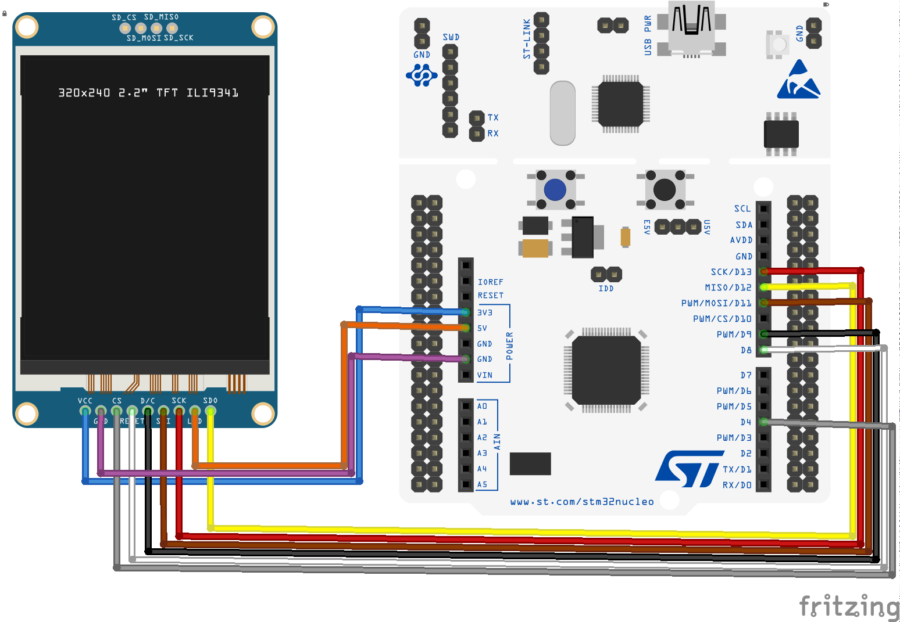

# How to use a TFT ILI9341 LCD with RIOT

Use a TFT ILI9341 LCD with an [STM32 Nucleo-64 F401RE development board](https://www.st.com/en/evaluation-tools/nucleo-f401re.html) and the [RIOT operating system](https://github.com/RIOT-OS/RIOT).

## For this application we will use
- STM32 Nucleo-64 F401RE
- 2.8" TFT ILI9341 LCD with 240RGBx320 resolution connected via SPI serial
- 9 Female to male jumper wires

## STM32 Nucleo-64 F401RE development board

The [STM32 Nucleo-64 F401RE](https://www.st.com/en/evaluation-tools/nucleo-f401re.html) is a low-cost development board that utilizes a 32-bit ARM Cortex-M4 processor to power various combinations of performance and power consumption. The CPU frequency can go as high as 84 MHz while the power consumption can go as low as 2.4uA at standby without RTC. The STM32 Nucleo board supports the ARDUINO® Uno V3 connectivity headers and the ST morpho headers allowing the easy expansion of the functionality with a wide choice of specialized shields.

## The RIOT operating system

The [RIOT](https://github.com/RIOT-OS/RIOT) is an open-source microkernel-based operating system designed for very low memory and energy footprint suitable for embedded devices that depend on real-time capabilities. RIOT provides out-of-the-box support for a very wide low-power wireless and communication stacks, making it an ideal choice to build Internet of Things (IoT) platforms.

## Hardware setup of the TFT ILI9341 LCD with the STM32 Nucleo-64 F401RE board

The ILI9341 is a 262144-color single-chip SOC driver for a TFT liquid crystal display with resolution of 240x320 dots (RGB), comprising a 720-channel source driver, a 320-channel gate driver, 172800 bytes GRAM for graphic display data of 240x320 dots (RGB), and power supply circuit.

ILI9341 can operate with 1.65V ~ 3.3V I/O interface voltage. ILI9341 supports parallel 8-/9-/16-/18-bit data bus MCU interface, 6-/16-/18-bit data bus RGB interface and 3-/4-line serial peripheral interface (SPI). In this example we will connect the TFT LCD via the SPI.

The TFT ILI9341 LCD has the following pins:
- connect the VCC with the **3V3 pin** of the STM32 Nucleo board,
- connect the GND pin with the **GND pin** of the STM32 Nucleo board,
- connect the CS pin with the **PWM/CS/D10 pin** of the STM32 Nucleo board.
- connect the RESET pin with the **D8 pin** of the STM32 Nucleo board.
- connect the DC pin with the **D9 pin** of the STM32 Nucleo board.
- connect the SDI (MOSI) pin with the **PWM/MOSI/D11 pin** of the STM32 Nucleo board.
- connect the SCK pin with the **SCK/D13 pin** of the STM32 Nucleo board.
- connect the LED pin with the **5V pin** of the STM32 Nucleo board.
- connect the SDO (MISO) pin with the **MISO/D12 pin** of the STM32 Nucleo board.

The wiring of the components is shown in the figure below.



For more information about the features of the ILI9341 controller  and how to integrate it in your project, you check the [ILI9341 specifications](https://cdn-shop.adafruit.com/datasheets/ILI9341.pdf).

## Setting up the TFT ILI9341 LCD in the RIOT operating system

RIOT provides a driver for the [ILI9341 display controller](https://api.riot-os.org/group__drivers__ili9341.html). The driver module allows to methods to initialize the TFT LCD display device, draw rectangles and write text characters.

In this example we will not use this driver. We will use the [ucglib](https://github.com/olikraus/ucglib), a graphic library for true color TFT and OLED graphics for embedded systems. displays for embedded devices. The _ucglib_ library supports the ST7735, ILI9341, PCF8833, SSD1351, LD50T6160, ILI9163 display controllers and offers a very rich set of graphic procedures and supports many fonts. The UCG library is developed for the Arduino IDE. Check out the [Reference Manual](https://github.com/olikraus/ucglib/wiki) for a detailed presentation.

The _ucglib_ library is available as a [RIOT package](http://doc.riot-os.org/group__pkg__ucglib.html), that is, an external library that is not included in the central repository. RIOT packages can be built out-of-source, that is, the source code of external packages is fetched in a global location, under the directory `$(RIOTBASE)/build/pkg/$(PKG_NAME)`.

To add the _ucglib_ package to the list of compiled modules you have to add it to the USEPKG macro in the [Makefile](Makefile) as follows:

```
USEPKG += ucglib
```

Since we are using the SPI to control the TFT LCD, we also need to specify in the [Makefile](Makefile) that we wish to use the _periph_spi_ and _periph_gpio_ modules.

```
FEATURES_REQUIRED += periph_gpio periph_spi
```

In the [main.c](main.c) we also need to include the following header files:

```
#include "periph/gpio.h"
#include "periph/spi.h"

#include "ucg.h"
#include "ucg_riotos.h"
```

The _ucglib_ initialization function _ucg_Init()_ requires us to specify the SPI device where the TFT is connected and specify the CS, CD (in the TFT noted as DC, see previous section) and RESET pins. In our case we use the first SPI device, and the **D10**, **D9** and **D8** pins of the STM32 Nucleo F401RE board. We need to consult the [user manual UM1724 of the STM32 Nucleo F401RE board](https://www.st.com/resource/en/user_manual/dm00105823-stm32-nucleo64-boards-mb1136-stmicroelectronics.pdf) to identify that
- the **D10 pin** of the ARDUINO® Uno V3 connectivity headers corresponds to the MCU's **GPIO pin PB6**
- the **D9 pin** of the ARDUINO® Uno V3 connectivity headers corresponds to the MCU's **GPIO pin PC7**
- the **D8 pin** of the ARDUINO® Uno V3 connectivity headers corresponds to the MCU's **GPIO pin PA9**

Therefore in the [main.c](main.c) we fix the port as follows:

```
static ucg_riotos_t user_data =
{
    .device_index = SPI_DEV(0),
    .pin_cs = GPIO_PIN(PORT_B, 6),
    .pin_cd = GPIO_PIN(PORT_C, 7),
    .pin_reset = GPIO_PIN(PORT_A, 9),
};
```

Now we can initialize the _ucglib_ as follows:

```
ucg_t ucg;

ucg_SetUserPtr(&ucg, &user_data);

ucg_Init(&ucg, ucg_dev_ili9341_18x240x320, ucg_ext_ili9341_18,
         ucg_com_hw_spi_riotos);
```

## Graphics drawing with the ILI9341 TFT

The _ucglib_ provides a number of functions to draw lines, rectangles, triangles, circles, and many other shapes on the TFT. The [reference manual](https://github.com/olikraus/ucglib/wiki/reference) provides multiple examples.

In this application we start by drawing the RIOT logo which is available as 96x48 pixels in RGB format (24 bits). Instead of providing the logo as an image (e.g., of JPG format) through an SD card, instead we use an [C array](logo.h) that defines the colors of each of the 4608 pixel of the image:


Therefore we need to also include the [logo.h](logo.h) file:

```
#include "logo.h"
```

To draw the logo we use the following code in the [main.c](main.c):

```
ucg_ClearScreen(&ucg);

for (int y = 0; y < 48; y++) {
    for (int x = 0; x < 96; x++) {
        uint32_t offset = (x + (y * 96)) * 3;

        ucg_SetColor(&ucg, 0, logo[offset + 0], logo[offset + 1],
                     logo[offset + 2]);
        ucg_DrawPixel(&ucg, x, y);
    }
}
```

## Text drawing with the ILI9341 TFT

The _ucglib_ supports a number of fonts and offers multiple methods to orient the screen and draw text on the TFT. The [reference manual](https://github.com/olikraus/ucglib/wiki/reference) provides multiple examples.

In this application we will use the Helvetica font, size 18, and orient the screen vertically as follows:

```
ucg_SetRotate270(&ucg);
ucg_SetFontMode(&ucg, UCG_FONT_MODE_TRANSPARENT);
ucg_SetFont(&ucg, ucg_font_helvR18_tf);
```

Drawing strings is simply done by specifying the x,y coordinates where the top-left of the first character will be placed.

```
ucg_DrawString(&ucg, 10, 80, 0, "MQTT-SN example app");
```

The color of the text can be specifying by providing the RGB encoding:

```
ucg_SetColor(&ucg, 0, 255, 255, 255);
```
